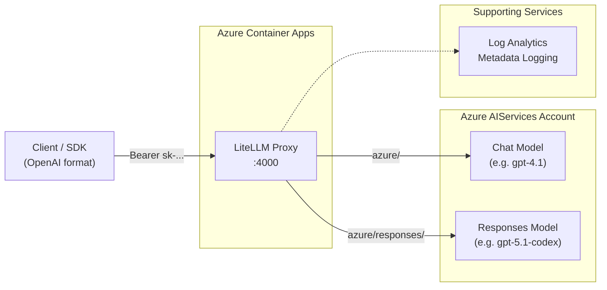

# AzureLIT

An OpenAI-compatible LLM gateway powered by [LiteLLM](https://github.com/BerriAI/litellm), running on Azure Container Apps. Unifies Azure AI Foundry model deployments behind a single, standardized API.

## Overview

AzureLIT provides a lightweight, cost-conscious HTTPS gateway that exposes Azure AI Foundry models through an OpenAI-compatible interface.

## Features

- **OpenAI-Compatible API**: Drop-in replacement for OpenAI SDK clients
- **Multi-Model Support**: Declarative `var.models` map — add a model with one Terraform map entry
- **Authentication**: Custom auth handler validates distributed client API keys and the master key
- **Usage Tracking**: Per-key analytics with Azure Log Analytics — track tokens, cache usage, cost, and failures
- **Infrastructure as Code**: Fully automated deployment via Terraform
- **Observability**: Azure Monitor integration with metadata-only logging (no prompt/response content)
- **Hardened Deployment**: Pinned LiteLLM image, HTTPS-only ingress, disabled UI/key routes, and constrained scale settings

## Quick Start

### Prerequisites

- Azure subscription
- Terraform >= 1.0
- Azure CLI (for authentication)
- direnv (recommended for secret injection)

### Configuration

1. Copy the example environment file and configure your secrets:

```bash
cd infra
cp example.env .env
```

2. Edit `.env` with your values:

```bash
# Required - Your Azure subscription ID
TF_VAR_subscription_id=your-subscription-id

# Required - Master key for admin/operator access (must start with 'sk-')
TF_VAR_litellm_master_key=sk-your-secure-master-key

# Required - Comma-separated client API keys distributed to consumers
TF_VAR_api_keys=sk-clientA,sk-clientB

# Optional - Override defaults
TF_VAR_location=germanywestcentral
TF_VAR_resource_group_name=AzureLIT-POC
```

3. Load the env vars (with direnv: `direnv allow`; without:)

```bash
export $(grep -v '^#' .env | grep -v '^$' | xargs)
```

### Deploy

```bash
cd infra
terraform init
terraform plan -out=tfplan
terraform apply tfplan
```

After deployment, Terraform outputs the container app URL:

```
container_app_fqdn = "litellm-proxy.<env>.<region>.azurecontainerapps.io"
container_app_url  = "https://litellm-proxy.<env>.<region>.azurecontainerapps.io"
```

### Test the Deployment

```bash
# Set your deployed URL and a client API key
ENDPOINT="https://<your-container-app-fqdn>"
API_KEY="sk-clientA"

# List available models
curl -sS \
  -H "Authorization: Bearer $API_KEY" \
  "$ENDPOINT/v1/models"

# Replace model names below with models you actually deployed.

# Test chat completion
curl -sS \
  -H "Authorization: Bearer $API_KEY" \
  -H "Content-Type: application/json" \
  -d '{
    "model": "gpt-4.1",
    "messages": [{"role": "user", "content": "Hello!"}],
    "stream": false
  }' \
  "$ENDPOINT/v1/chat/completions"

# Test with streaming
curl -sS \
  -H "Authorization: Bearer $API_KEY" \
  -H "Content-Type: application/json" \
  -d '{
    "model": "grok-4-20-reasoning",
    "messages": [{"role": "user", "content": "Count to 5"}],
    "stream": true
  }' \
  "$ENDPOINT/v1/chat/completions"
```

### Inspect Deployable Models (Azure CLI Helper)

To avoid guessing model name/version/SKU combinations, use:

```bash
cd infra
./list-deployable-models.sh --name codex
```

Useful filters:

```bash
# Only models that support the Responses API
./list-deployable-models.sh --capability responses

# Search by family + capability
./list-deployable-models.sh --name gpt-5.1 --capability responses

# Check models supporting a specific SKU
./list-deployable-models.sh --sku DataZoneStandard
```

Requirements: `az` (logged in) and `jq` installed locally.

Recommended workflow before editing `infra/openai.tf`:

```bash
# 1) Discover what this account can actually deploy
./list-deployable-models.sh --name gpt-5 --capability responses

# 2) Pick exact name + version + SKU from output
# 3) Add/update the entry in var.models
# 4) Deploy with terraform plan/apply
```

If `responses=true` and `chatCompletion=false`, set `responses_only = true`.

### Using with OpenAI SDK

```python
from openai import OpenAI

client = OpenAI(
    api_key="sk-clientA",
    base_url="https://<your-container-app-fqdn>"
)

response = client.chat.completions.create(
    model="gpt-4.1",
    messages=[{"role": "user", "content": "Hello!"}],
    stream=False
)

print(response.choices[0].message.content)
```


## Architecture



### Components

- **Azure Container Apps**: Hosts LiteLLM Proxy with external HTTPS ingress
- **Azure AIServices Cognitive Account** (`kind = "AIServices"`): Unified Foundry resource hosting all model deployments
- **Regional AIServices Accounts**: Created automatically when `var.models` targets a non-primary region
- **Azure Foundry Project** (`azurerm_cognitive_account_project`): Created automatically; used by models requiring project-scoped deployment (`project = true`)
- **Log Analytics**: Metadata-only logging (no prompt/response content)
- **Log Analytics**: Per-key usage tracking (tokens, cache usage, cost, failures)

### Example Model Configurations

The table below shows example model configurations from this repo. Actual deployability varies by subscription, region, quota, and Azure rollout stage. Use `infra/list-deployable-models.sh` to discover what you can deploy, then add entries to `var.models` in `infra/openai.tf`.

| Model (example) | Format | SKU | Region | API Surface |
|-----------------|--------|-----|--------|-------------|
| `gpt-4.1` | `OpenAI` | DataZoneStandard | `germanywestcentral` | Chat Completions |
| `gpt-5.1-codex` | `OpenAI` | GlobalStandard | `germanywestcentral` | Responses API only |

Responses-only models (e.g., codex variants) set `responses_only = true` and use LiteLLM's `azure/responses/` prefix with `api_version=preview`.

## Authentication

The deployment uses a custom auth handler in `infra/custom_auth.py`:

- Set `TF_VAR_api_keys` to a comma-separated list of distributed client keys
- Set `TF_VAR_litellm_master_key` with a value starting with `sk-` for operator/admin use
- Clients authenticate with `Authorization: Bearer <api_key>`
- The custom auth handler also accepts the master key so admin operations still work

## Usage Tracking

Per-key usage analytics are tracked in Azure Log Analytics:

```bash
# Daily summary
python scripts/usage-report.py --date 2026-04-15

# Date range
python scripts/usage-report.py --from 2026-04-01 --to 2026-04-15

# Export to CSV
python scripts/usage-report.py --from 2026-04-01 --to 2026-04-15 --format csv > usage.csv
```

See [docs/USAGE_ANALYSIS.md](docs/USAGE_ANALYSIS.md) for full documentation.

## Security

- **Defender for AI Services**: Configured as Free tier (disabled) — see [docs/DEFENDER_AI_SERVICES.md](docs/DEFENDER_AI_SERVICES.md) for details on enabling Standard tier for production workloads

## Roadmap

See the `## Next Steps` sections in `docs/ARCHITECTURE.md` and `docs/DEPLOYMENT_SUMMARY.md`.

## Security Notes

- **Secrets**: Never commit `.env` or `*.tfvars` files (both are gitignored)
- **Logging**: No prompt/response content is logged; only metadata (timestamps, latency, token counts)
- **HTTPS Only**: Container Apps enforces TLS on external ingress
- **Proxy Hardening**: `disable_admin_ui: true`, `disable_key_management: true`, `drop_params: true`, `drop_unknown_params: true`
- **Runtime Hardening**: LiteLLM image pinned to `ghcr.io/berriai/litellm:main-v1.82.3`, `min_replicas = 0`, `max_replicas = 1`, `cooldown_period_in_seconds = 600`
- **Least Privilege**: Managed identities used where possible

## Documentation

- [ARCHITECTURE](docs/ARCHITECTURE.md) - Architecture and deployment behavior
- [DEPLOYMENT_SUMMARY](docs/DEPLOYMENT_SUMMARY.md) - Operational summary
- [MASTER_KEY_MANAGEMENT](docs/MASTER_KEY_MANAGEMENT.md) - Master/client key operations
- [CUSTOM_AUTH](docs/CUSTOM_AUTH.md) - Custom auth implementation
- [USAGE_ANALYSIS](docs/USAGE_ANALYSIS.md) - Per-key usage tracking and reporting
- [USAGE_TRACKING_IMPLEMENTATION](docs/USAGE_TRACKING_IMPLEMENTATION.md) - Implementation details
- [DEFENDER_AI_SERVICES](docs/DEFENDER_AI_SERVICES.md) - Defender for AI Services security documentation
- [LINKS](docs/LINKS.md) - External references

## License

TBD
