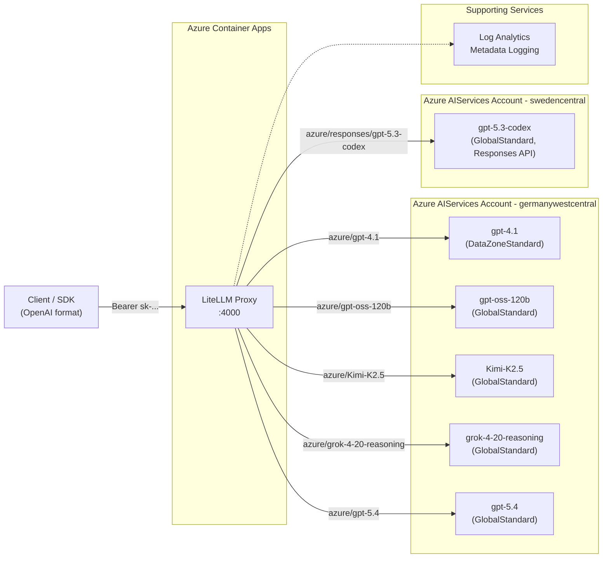

# AzureLIT

An OpenAI-compatible LLM gateway powered by [LiteLLM](https://github.com/BerriAI/litellm), running on Azure Container Apps. Unifies Azure AI Foundry model deployments behind a single, standardized API.

## Overview

AzureLIT provides a lightweight, cost-conscious HTTP gateway that exposes Azure AI Foundry models through an OpenAI-compatible interface. It supports streaming chat completions, responses-only model deployments, and minimal operational overhead.

**Current State:** Proof-of-Concept (PoC) with LiteLLM Proxy

## Features

- **OpenAI-Compatible API**: Drop-in replacement for OpenAI SDK clients
  - `POST /v1/chat/completions` with streaming support
  - `GET /v1/models` for model discovery
- **Multi-Model Support**: Declarative `var.models` map — add a model with one Terraform map entry
- **Authentication**: Custom auth handler validates distributed client API keys and the master key
- **Infrastructure as Code**: Fully automated deployment via Terraform
- **Observability**: Azure Monitor integration with metadata-only logging (no prompt/response content)
- **Hardened Deployment**: Pinned LiteLLM image, HTTPS-only ingress, disabled UI/key routes, and constrained scale settings

## Quick Start

### Prerequisites

- Azure subscription
- Terraform >= 1.0
- Azure CLI (for authentication)
- direnv (recommended for secret injection)

### Configuration

1. Copy the example environment file and configure your secrets:

```bash
cd infra
cp example.env .env
```

2. Edit `.env` with your values:

```bash
# Required - Your Azure subscription ID
TF_VAR_subscription_id=your-subscription-id

# Required - Master key for admin/operator access (must start with 'sk-')
TF_VAR_litellm_master_key=sk-your-secure-master-key

# Required - Comma-separated client API keys distributed to consumers
TF_VAR_api_keys=sk-clientA,sk-clientB

# Optional - Override defaults
TF_VAR_location=germanywestcentral
TF_VAR_resource_group_name=AzureLIT-POC
```

3. Load the env vars (with direnv: `direnv allow`; without:)

```bash
export $(grep -v '^#' .env | grep -v '^$' | xargs)
```

### Deploy

```bash
cd infra
terraform init
terraform plan -out=tfplan
terraform apply tfplan
```

After deployment, Terraform outputs the container app URL:

```
container_app_fqdn = "litellm-proxy.<env>.<region>.azurecontainerapps.io"
container_app_url  = "https://litellm-proxy.<env>.<region>.azurecontainerapps.io"
```

### Test the Deployment

```bash
# Set your deployed URL and a client API key
ENDPOINT="https://<your-container-app-fqdn>"
API_KEY="sk-clientA"

# List available models
curl -sS \
  -H "Authorization: Bearer $API_KEY" \
  "$ENDPOINT/v1/models"

# Replace model names below with models you actually deployed.

# Test chat completion
curl -sS \
  -H "Authorization: Bearer $API_KEY" \
  -H "Content-Type: application/json" \
  -d '{
    "model": "gpt-4.1",
    "messages": [{"role": "user", "content": "Hello!"}],
    "stream": false
  }' \
  "$ENDPOINT/v1/chat/completions"

# Test with streaming
curl -sS \
  -H "Authorization: Bearer $API_KEY" \
  -H "Content-Type: application/json" \
  -d '{
    "model": "grok-4-20-reasoning",
    "messages": [{"role": "user", "content": "Count to 5"}],
    "stream": true
  }' \
  "$ENDPOINT/v1/chat/completions"
```

### Inspect Deployable Models (Azure CLI Helper)

To avoid guessing model name/version/SKU combinations, use:

```bash
cd infra
./list-deployable-models.sh --name codex
```

Useful filters:

```bash
# Only models that support the Responses API
./list-deployable-models.sh --capability responses

# Search by family + capability
./list-deployable-models.sh --name gpt-5.1 --capability responses

# Check models supporting a specific SKU
./list-deployable-models.sh --sku DataZoneStandard
```

Requirements: `az` (logged in) and `jq` installed locally.

Recommended workflow before editing `infra/openai.tf`:

```bash
# 1) Discover what this account can actually deploy
./list-deployable-models.sh --name gpt-5 --capability responses

# 2) Pick exact name + version + SKU from output
# 3) Add/update the entry in var.models
# 4) Deploy with terraform plan/apply
```

If `responses=true` and `chatCompletion=false`, set `responses_only = true`.

### Using with OpenAI SDK

```python
from openai import OpenAI

client = OpenAI(
    api_key="sk-clientA",
    base_url="https://<your-container-app-fqdn>"
)

response = client.chat.completions.create(
    model="gpt-4.1",
    messages=[{"role": "user", "content": "Hello!"}],
    stream=False
)

print(response.choices[0].message.content)
```

## Project Structure

```
.
├── infra/                    # Terraform infrastructure
│   ├── main.tf              # Core resources (RG, Log Analytics, Container Apps)
│   ├── openai.tf            # var.models map, AIServices account, Foundry project, deployments
│   ├── kv.tf                # Comment-only; Key Vault removed in new Foundry
│   ├── config.yaml.tpl      # LiteLLM Proxy config template (rendered by Terraform)
│   ├── custom_auth.py       # Custom auth handler injected into the container
│   ├── list-deployable-models.sh # Azure CLI + jq helper for deployable models
│   ├── outputs.tf           # Deployment outputs (FQDN, URL)
│   ├── rai.tf               # Permissive RAI policies for primary/regional accounts
│   ├── example.env          # Example environment variables
│   └── .env                 # Your secrets (gitignored)
├── docs/                     # Design and operational documentation
│   ├── PRD.md               # Product Requirements Document (MVP scope)
│   ├── POC.md               # Proof-of-Concept approach (current)
│   ├── DEPLOYMENT_SUMMARY.md # Operational summary
│   ├── MASTER_KEY_MANAGEMENT.md # Master/client key operations
│   ├── CUSTOM_AUTH.md       # Custom auth behavior and limits
│   └── LINKS.md             # External references
└── AGENTS.md                 # Agent-specific project context
```

## Architecture



### Components

- **Azure Container Apps**: Hosts LiteLLM Proxy with external HTTPS ingress
- **Azure AIServices Cognitive Account** (`kind = "AIServices"`): Unified Foundry resource hosting all model deployments
- **Regional AIServices Accounts**: Created automatically when `var.models` targets a non-primary region
- **Azure Foundry Project** (`azurerm_cognitive_account_project`): Created automatically; used by models requiring project-scoped deployment (`project = true`)
- **Log Analytics**: Metadata-only logging (no prompt/response content)

### Example Models (Snapshot)

The model list below is an example snapshot for documentation context and may drift from the current Terraform source. Actual deployability varies by subscription, region, quota, and Azure rollout stage. Use `infra/list-deployable-models.sh` before editing `var.models`. Treat `infra/openai.tf` and Azure CLI model discovery as operational truth.

| Model | Format | SKU | Region | LiteLLM identifier |
|-------|--------|-----|--------|--------------------|
| `gpt-4.1` | `OpenAI` | DataZoneStandard | `germanywestcentral` | `azure/gpt-4.1` |
| `gpt-oss-120b` | `OpenAI-OSS` | GlobalStandard | `germanywestcentral` | `azure/gpt-oss-120b` |
| `Kimi-K2.5` | `MoonshotAI` | GlobalStandard | `germanywestcentral` | `azure/Kimi-K2.5` |
| `grok-4-20-reasoning` | `xAI` | GlobalStandard | `germanywestcentral` | `azure/grok-4-20-reasoning` |
| `gpt-5.4` | `OpenAI` | GlobalStandard | `germanywestcentral` | `azure/gpt-5.4` |
| `gpt-5.3-codex` | `OpenAI` | GlobalStandard | `swedencentral` | `azure/responses/gpt-5.3-codex` |

All models are declared in the `var.models` map in `infra/openai.tf`. Adding a model = one map entry + `terraform apply`. Responses-only models set `responses_only = true` and are rendered with LiteLLM's `azure/responses/` prefix plus `api_version=preview`.

## Authentication

The PoC uses a custom auth handler in `infra/custom_auth.py`:

- Set `TF_VAR_api_keys` to a comma-separated list of distributed client keys
- Set `TF_VAR_litellm_master_key` with a value starting with `sk-` for operator/admin use
- Clients authenticate with `Authorization: Bearer <api_key>`
- The custom auth handler also accepts the master key so admin operations still work
- No per-key budgets or model restrictions yet

See [docs/MASTER_KEY_MANAGEMENT.md](docs/MASTER_KEY_MANAGEMENT.md) for details.

## Roadmap

- **PoC (Current)**: LiteLLM Proxy on Container Apps, custom auth with client API keys, dynamic model map
- **MVP v0.1**: Custom FastAPI gateway, Table Storage key validation, Azure Monitor
- **MVP v0.2**: Streaming support, dual-surface routing
- **MVP v0.3**: Model discovery poller, `/v1/models` endpoint
- **v0.4+**: Embeddings, expanded catalog, Terraform hardening

See [docs/PRD.md](docs/PRD.md) for full MVP scope.

## Security Notes

- **Secrets**: Never commit `.env` or `*.tfvars` files (both are gitignored)
- **Logging**: No prompt/response content is logged; only metadata (timestamps, latency, token counts)
- **HTTPS Only**: Container Apps enforces TLS on external ingress
- **Proxy Hardening**: `disable_admin_ui: true`, `disable_key_management: true`, `drop_params: true`, `drop_unknown_params: true`
- **Runtime Hardening**: LiteLLM image pinned to `ghcr.io/berriai/litellm:main-v1.82.3`, `min_replicas = 0`, `max_replicas = 1`, `cooldown_period_in_seconds = 600`
- **Least Privilege**: Managed identities used where possible

## Documentation

- [PRD](docs/PRD.md) - Product Requirements Document
- [POC](docs/POC.md) - Proof-of-Concept deployment guide
- [DEPLOYMENT_SUMMARY](docs/DEPLOYMENT_SUMMARY.md) - Operational summary
- [MASTER_KEY_MANAGEMENT](docs/MASTER_KEY_MANAGEMENT.md) - Master/client key operations
- [CUSTOM_AUTH](docs/CUSTOM_AUTH.md) - Current custom auth implementation
- [LINKS](docs/LINKS.md) - External references

## License

TBD
