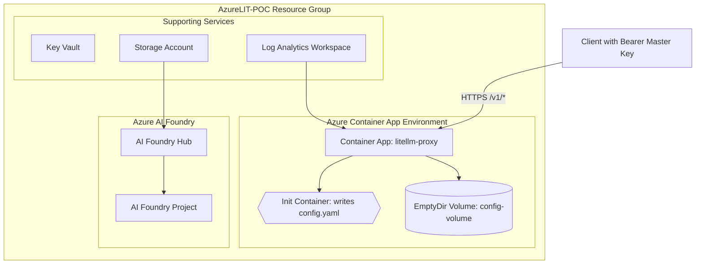

### Deployment Summary (Updated)

This Terraform plan deploys a Proof-of-Concept (PoC) for the AzureLIT OpenAI-compatible gateway. The deployment creates the following resources in **Sweden Central** within the **AzureLIT-POC** resource group:

1.  **Azure Container App** running the LiteLLM proxy with external HTTPS ingress.
2.  **Azure AI Foundry Hub and Project** for model management.
3.  **Azure Key Vault** to store secrets (PoC level).
4.  **Azure Storage Account** used by AI Foundry Hub.
5.  **Log Analytics Workspace** for observability.

#### Config Injection Approach (ACA)

Due to limitations and API constraints around mounting Container Apps secrets as volumes (storageType `Secret`), we implemented a robust workaround using an init container and an EmptyDir volume:

- A `secret` named `config-yaml` stores the contents of configuration file.
- An `init_container` (`busybox`) writes the secret value to `/mnt/config/config.yaml`.
- An `EmptyDir` `volume` named `config-volume` is mounted to both the init container and the main LiteLLM container.
- The main container runs with args `--config /app/config.yaml` and mounts `/app` to the same `config-volume`, making the config available at runtime.

This avoids the brittle and currently error-prone `Secret` volume mount path and works consistently across provider versions.

#### Authentication Enforcement (PoC Hardening)

- Configure a single master key via `LITELLM_MASTER_KEY` (injected as a Container Apps secret).
- Enforce strict API key validation using LiteLLM `custom_auth` with a minimal validator that only accepts the configured master key.
- Set `custom_auth_settings.mode: on` to prevent fallback to permissive auth paths.
- Enable `litellm_settings.drop_params: true` to block clients from overriding provider credentials (api_key, api_base, model, etc.).
- Disable forwarding client headers to upstream with `forward_client_headers_to_llm_api: false`.
- Keep DB features disabled (`store_model_in_db: false`, `disable_spend_logs: true`, etc.) for a DB-less PoC.

Clients must send `Authorization: Bearer <LITELLM_MASTER_KEY>` to access `/v1/*` endpoints.

### Mermaid Diagram

